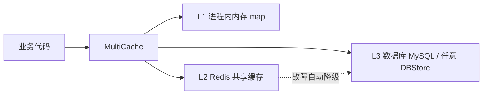
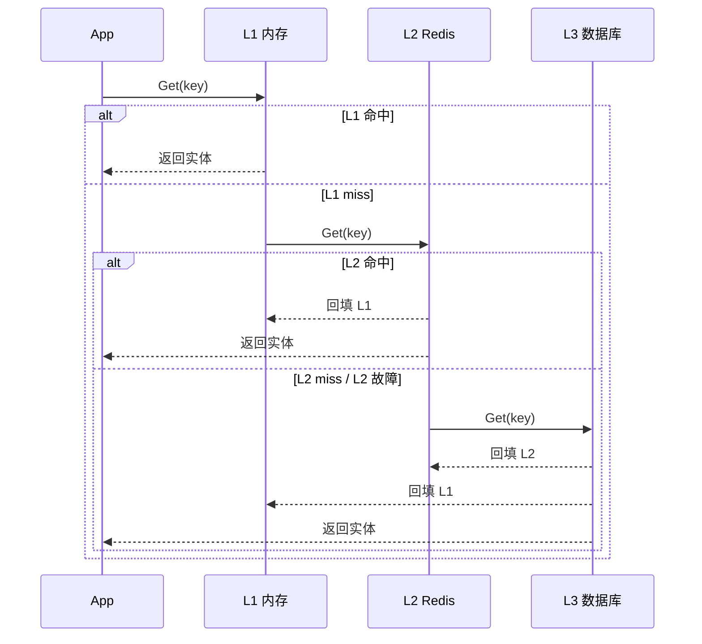
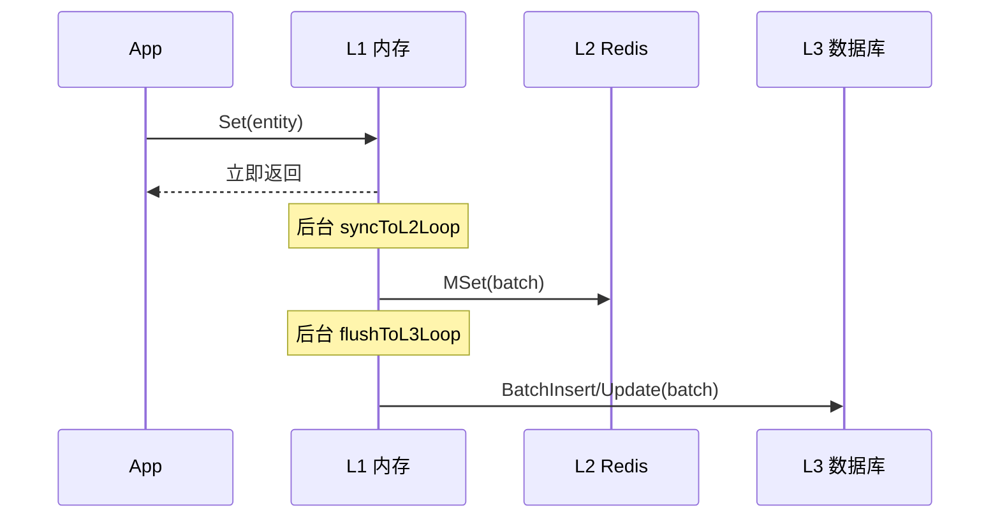
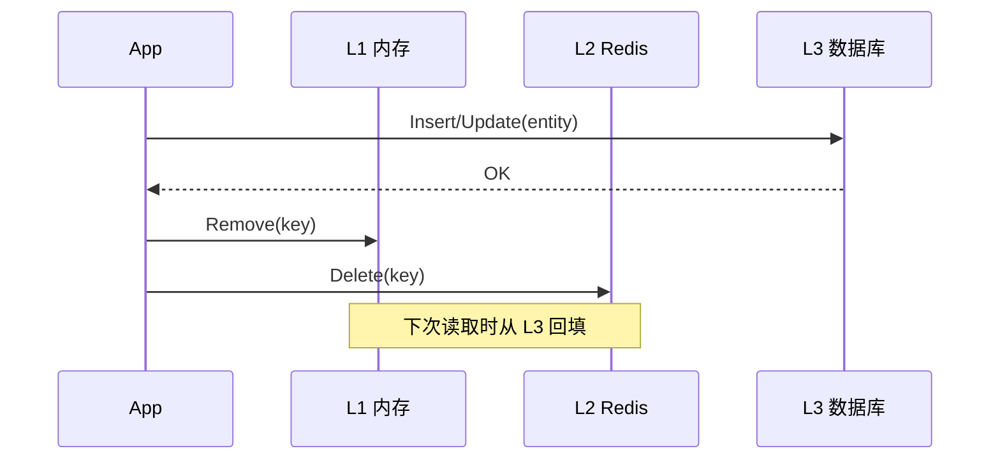

# mcachedb

[](https://pkg.go.dev/github.com/quietking0312/component/mcachedb)
[](https://goreportcard.com/report/github.com/quietking0312/component/mcachedb)
[](LICENSE)

`mcachedb` 是一个 Go 语言三级缓存库，面向**读多写少、需要最终一致或强一致可选**的业务场景。

## 整体架构



- **读路径**：L1 → L2 → L3，逐级穿透并自动回填上层缓存。
- **写路径**：支持异步批量、同步直写、CacheAside 三种模式，以及多级缓存专用的 WriteL2 模式。
- **L2 容错**：Redis 故障自动降级为 L1 + L3，后台定时探测恢复。
- **事务**：单缓存本地事务 + 跨缓存最大努力分布式事务。

---

## 目录

- [安装](#安装)
- [快速开始](#快速开始)
- [架构与数据流转](#架构与数据流转)
- [写入模式](#写入模式)
- [自定义 L2/L3 实现](#自定义-l2l3-实现)
- [L2 Redis 配置](#l2-redis-配置)
- [辅助构建器](#辅助构建器)
- [事务](#事务)
- [泛型实体](#泛型实体)
- [SQLXStore 通用存储](#sqlxstore-通用存储)
- [统计与监控](#统计与监控)
- [性能参考](#性能参考)
- [接口总览](#接口总览)
- [选型建议](#选型建议)
- [License](#license)

---

## 安装

```bash
go get github.com/quietking0312/component/mcachedb
```

依赖：

- `github.com/jmoiron/sqlx`
- `github.com/redis/go-redis/v9`
- `github.com/stretchr/testify`（仅测试）

---

## 快速开始

### 1. 定义实体

`BaseEntity` 只提供 `CacheKey`、`Version`、`IsDeleted`、`Copy` 等基础能力，**不提供 `Marshal/Unmarshal` 的默认实现**。业务实体必须自己实现序列化，否则编译不通过。

```go
package main

import (
    "encoding/json"

    "github.com/quietking0312/component/mcachedb"
)

type Player struct {
    mcachedb.BaseEntity
    Name  string `json:"name"`
    Level int    `json:"level"`
}

func NewPlayer(id, name string, level int) *Player {
    return &Player{
        BaseEntity: *mcachedb.NewBaseEntity(id),
        Name:       name,
        Level:      level,
    }
}

func (p *Player) Copy() mcachedb.Entity {
    return &Player{
        BaseEntity: *p.BaseEntity.Copy(),
        Name:       p.Name,
        Level:      p.Level,
    }
}

func (p *Player) Marshal() ([]byte, error) { return json.Marshal(p) }
func (p *Player) Unmarshal(b []byte) error { return json.Unmarshal(b, p) }
```

如果你不想手写完整 `Entity`，可以直接使用内置的 [泛型实体 `GenericEntity[T]`](#泛型实体)。

### 2. 准备 L3 存储

可以直接实现 [`DBStore`](#接口总览) 接口，也可以使用内置的 `SQLXStore`：

```go
// 方式一：内置 SQLXStore（自动建表、通用 JSON 列）
l3, err := mcachedb.NewSQLXStore("root:pass@tcp(127.0.0.1:3306)/game", &Player{})
if err != nil {
    panic(err)
}

// 方式二：从已有 *sqlx.DB 创建
l3, err = mcachedb.NewSQLXStoreFromDB(db, &Player{})
```

### 3. 准备 L2 存储（可选）

可以直接实现 [`L2Store`](#接口总览) 接口，也可以使用内置的 `RedisStore`：

```go
l2, err := mcachedb.NewRedisStore(&mcachedb.RedisConfig{
    Addr:       "127.0.0.1:6379",
    KeyPrefix:  "player:",
    DefaultTTL: 10 * time.Minute,
}, &Player{}) // entityType 用于反序列化时保持具体类型
if err != nil {
    panic(err)
}
```

传 `nil` 则退化为 **L1 + L3** 两级缓存。

### 4. 创建 MultiCache

```go
cache, err := mcachedb.NewMultiCache(l3, l2, &mcachedb.MultiCacheConfig{
    L1MaxSize:      100_000,
    FlushInterval:  1 * time.Second,       // L1 -> L3 刷盘间隔
    SyncInterval:   500 * time.Millisecond, // L1 -> L2 同步间隔
    WriteMode:      mcachedb.WriteModeAsync,  // 默认：L2/L3 均异步；WriteModeWriteL2 可同步写 L2
})
if err != nil {
    panic(err)
}
defer cache.Close()
```

### 5. 读写删

```go
// 写
cache.Set(NewPlayer("u1", "Alice", 10))

// 读：L1 → L2 → L3，命中后自动回填
entity, err := cache.Get("u1")
if err != nil {
    panic(err)
}
player := entity.(*Player)

// 批量读
m, err := cache.MGet([]string{"u1", "u2", "u3"})

// 删
cache.Delete("u1")

// 立即把所有脏数据刷到 L3
cache.Flush()
```

---

## 架构与数据流转

### 读路径



### 写路径：异步模式（默认）



### 写路径：CacheAside 模式



---

## 写入模式

| 模式 | 常量 | 行为 | 适用场景 |
|------|------|------|----------|
| 异步（默认） | `WriteModeAsync` | 写 L1 返回，后台批量 flush L3，L2 定期 sync | 高吞吐、可接受秒级丢失 |
| 同步 | `WriteModeSync` | 写 L1 同时同步写 L3 | 需要每次写都落库 |
| 直写 | `WriteModeWriteL2` | 先写 L3，成功后再写 L1 | 写少读多，L1 与 L3 强一致 |
| 旁路 | `WriteModeCacheAside` | 先写 L3，成功后删除 L1/L2；下次读回填 | 业务最常用的强一致模式 |

```go
cache, _ := mcachedb.NewMultiCache(l3, l2, &mcachedb.MultiCacheConfig{
    WriteMode: mcachedb.WriteModeCacheAside,
})
```

### 异步模式的数据安全边界

默认配置下，极端情况（进程崩溃）最多丢失 `FlushInterval` 内的数据。若不能容忍，请选择 `WriteModeSync`、`WriteModeWriteL2` 或 `WriteModeCacheAside`，亦或在关键写后手动调用 `cache.Flush()`。

---

## 自定义 L2/L3 实现

`mcachedb` 通过接口解耦 L2/L3，你可以完全自定义：

```go
// 自定义 L3：例如对接已有分库分表、MongoDB 等
type MyDBStore struct{}

func (s *MyDBStore) Get(ctx context.Context, key string) (mcachedb.Entity, error) { ... }
func (s *MyDBStore) MGet(ctx context.Context, keys []string) (map[string]mcachedb.Entity, error) { ... }
func (s *MyDBStore) Insert(ctx context.Context, e mcachedb.Entity) error { ... }
func (s *MyDBStore) Update(ctx context.Context, e mcachedb.Entity) error { ... }
func (s *MyDBStore) Delete(ctx context.Context, key string) error { ... }
func (s *MyDBStore) BatchInsert(ctx context.Context, es []mcachedb.Entity) error { ... }
func (s *MyDBStore) BatchUpdate(ctx context.Context, es []mcachedb.Entity) error { ... }
func (s *MyDBStore) BatchDelete(ctx context.Context, keys []string) error { ... }
func (s *MyDBStore) Close() error { ... }

// 自定义 L2：例如本地 RocksDB、Memcached 等
type MyL2Store struct{}

func (s *MyL2Store) Get(ctx context.Context, key string) (mcachedb.Entity, error) { ... }
func (s *MyL2Store) MGet(ctx context.Context, keys []string) (map[string]mcachedb.Entity, error) { ... }
func (s *MyL2Store) Set(ctx context.Context, e mcachedb.Entity) error { ... }
func (s *MyL2Store) MSet(ctx context.Context, es []mcachedb.Entity) error { ... }
func (s *MyL2Store) Delete(ctx context.Context, key string) error { ... }
func (s *MyL2Store) Ping(ctx context.Context) error { ... }
func (s *MyL2Store) Close() error { ... }
```

然后直接传入：

```go
cache, _ := mcachedb.NewMultiCache(&MyDBStore{}, &MyL2Store{}, &mcachedb.MultiCacheConfig{})
```

---

## L2 Redis 配置

```go
type RedisConfig struct {
    Addr         string        // 单机地址，默认 localhost:6379
    Addrs        []string      // 集群节点列表，len > 1 时自动切换集群模式
    Password     string
    DB           int
    KeyPrefix    string        // Key 前缀，默认 "mcachedb:"
    DefaultTTL   time.Duration // 0 表示不过期
    PoolSize     int
    MinIdleConns int
    ClusterMode  bool          // 显式开启集群模式
}
```

集群模式下 `MGet`/`MSet`/`MDelete` 由 `go-redis` 自动按 slot 分片；`Subscribe` 仅在单机模式下可用。

### L2 故障降级与自动恢复

- L2 出现网络错误或超时后，自动标记 `l2Down`，读写跳过 L2 直通 L3。
- 后台每 `30s` 探测一次，连续 `2` 次 `Ping` 成功后恢复 L2。
- 默认 `WriteModeAsync`，L2 故障不会影响写成功率；`WriteModeWriteL2` 下 L2 写失败会回滚 L1。

---

## 辅助构建器

### SimpleConfig

```go
cache, err := mcachedb.NewSimpleCache(&Player{}, &mcachedb.SimpleConfig{
    DB:          db,
    RedisAddr:   "127.0.0.1:6379",
    RedisPrefix: "player:",
    L1Size:      50_000,
})
```

### Builder 链式

```go
cache, err := mcachedb.NewCacheBuilder(db, &Player{}).
    WithRedis("127.0.0.1:6379", "", 0).
    WithRedisPrefix("player:").
    WithL1Size(50_000).
    WithFlushInterval(500 * time.Millisecond).
    Build()
```

### 预设高可用模式

```go
// 写 L1 时同步写 L2，适合读多写少的共享缓存
cache, err := mcachedb.NewHighReliabilityCache(db, "127.0.0.1:6379", &Player{})

// 同上，且 flush 间隔缩短到 100ms，适合交易/充值等强一致场景
cache, err := mcachedb.NewUltraReliabilityCache(db, "127.0.0.1:6379", &Player{})
```

---

## 事务

### 单缓存事务 `Tx`

对同一个 `Cache` 的多个 key 原子提交，失败时逆序恢复内存旧值。

```go
tx, err := cache.Begin()
if err != nil {
    panic(err)
}

tx.Set(playerA)
tx.Delete("old-key")

if err := tx.Commit(); err != nil {
    _ = tx.Rollback()
}
```

### 跨缓存分布式事务 `DistTx`

协调多个 `MultiCache` 实例，采用"预读旧值 + 顺序提交 + 失败补偿"策略。

```go
tx := mcachedb.NewDistTx()
tx.AddSet(goldCache, newGold)
tx.AddSet(bagCache, newItem)

if err := tx.Commit(); err != nil {
    // 已执行的步骤会尽最大努力回滚
    log.Println(err)
}

// 提交后立即把涉及缓存的脏数据 flush 到 L3（适合交易场景）
if err := tx.CommitAndFlush(); err != nil {
    log.Println(err)
}
```

> `DistTx` 不提供跨进程的严格原子性（无两阶段提交），适用于同进程内多缓存的最大努力一致性。

---

## 泛型实体

不想手写完整 `Entity` 实现时，可使用内置泛型包装：

```go
type PlayerData struct {
    Name  string `json:"name"`
    Level int    `json:"level"`
}

entity := mcachedb.NewGenericEntity("u1", &PlayerData{Name: "Alice", Level: 10})
cache.Set(entity)
```

`GenericEntity[T]` 内置 JSON 序列化；若需要 Protobuf 等其他格式，需要自行子类化并覆盖 `Marshal`/`Unmarshal`。

---

## SQLXStore 通用存储

内置通用数据库存储，自动建表（MySQL），表结构：

| 列 | 类型 | 说明 |
|----|------|------|
| `cache_key` | VARCHAR(255) PK | `Entity.CacheKey()` |
| `cache_data` | JSON | 实体序列化数据 |
| `version` | BIGINT | 乐观锁版本号 |
| `is_deleted` | TINYINT | 软删除标记 |
| `updated_at` | TIMESTAMP | 自动更新时间 |

删除为软删除，可调用 `CleanExpired` 定期物理清理：

```go
store.CleanExpired(ctx, time.Now().Add(-24*time.Hour))
```

如果业务已有数据库表，直接实现 `DBStore` 接口即可，不必使用 `SQLXStore`。

---

## 统计与监控

```go
stats := cache.Stats()
fmt.Printf("L1=%d L2=%d L3=%d Miss=%d HitRate=%.2f%%\n",
    stats.L1Hits, stats.L2Hits, stats.L3Hits, stats.Misses,
    stats.HitRate()*100,
)
```

`MultiCacheStats` 提供：

| 字段 | 说明 |
|------|------|
| `L1Hits` | L1 命中次数 |
| `L2Hits` | L2 命中次数 |
| `L3Hits` | L3 命中次数 |
| `Misses` | 三级均未命中次数 |
| `HitRate()` | 总命中率 |

### 对接 Prometheus 示例

```go
import "github.com/prometheus/client_golang/prometheus"

var (
    cacheHit = prometheus.NewCounterVec(prometheus.CounterOpts{
        Name: "mcachedb_hit_total",
        Help: "mcachedb hit counter",
    }, []string{"cache", "level"})

    cacheMiss = prometheus.NewCounterVec(prometheus.CounterOpts{
        Name: "mcachedb_miss_total",
        Help: "mcachedb miss counter",
    }, []string{"cache"})
)

func recordStats(name string, c *mcachedb.MultiCache) {
    s := c.Stats()
    cacheHit.WithLabelValues(name, "l1").Add(float64(s.L1Hits))
    cacheHit.WithLabelValues(name, "l2").Add(float64(s.L2Hits))
    cacheHit.WithLabelValues(name, "l3").Add(float64(s.L3Hits))
    cacheMiss.WithLabelValues(name).Add(float64(s.Misses))
}
```

> 注意：`Stats()` 返回的是累计值，建议按固定间隔采样后做差值或 Counter 直接累加。

---

## 性能参考

以下数据为本地开发机（8C16G / 本机 Redis / 本机 MySQL）的粗略参考，**实际性能强烈建议结合业务实体大小、网络延迟、数据库负载自行压测**。

| 指标 | L1 | L2 Redis | L3 MySQL |
|------|----|----------|----------|
| 单次读取延迟 | ~300 ns ~ 1 μs | ~0.5 ms ~ 2 ms | ~5 ms ~ 20 ms |
| 单次写入延迟 | ~300 ns ~ 1 μs | ~0.5 ms ~ 2 ms | ~5 ms ~ 20 ms |

### 不同写入模式吞吐对比

| 模式 | 大致吞吐（ops/s） | 说明 |
|------|------------------|------|
| `WriteModeAsync` | 5w ~ 15w | 写 L1 即返回，批量 flush |
| `WriteModeSync` | 2k ~ 8k | 每次写同步落库 |
| `WriteModeWriteL2` | 3w ~ 8w | 同步写 L2，L3 异步；性能有所下降 |
| `WriteModeCacheAside` | 1k ~ 5k | 先写库再删缓存，读时回填 |

### 命中率建议

- L1 命中率建议在 **70% ~ 90%**。
- L2 命中率建议在 **20% ~ 50%**。
- L3 + Miss 控制在 **10% 以下**。

如果 L1 命中率偏低，可适当调大 `L1MaxSize` 或缩短 `CleanupInterval`。

---

## 接口总览

```go
// 实体
type Entity interface {
    CacheKey() string
    IsDeleted() bool
    SetDeleted(bool)
    Version() int64
    IncrementVersion()
    Copy() Entity
    Marshal() ([]byte, error)
    Unmarshal([]byte) error
}

// L3 数据库存储
type DBStore interface {
    Get(ctx context.Context, key string) (Entity, error)
    MGet(ctx context.Context, keys []string) (map[string]Entity, error)
    Insert(ctx context.Context, entity Entity) error
    Update(ctx context.Context, entity Entity) error
    Delete(ctx context.Context, key string) error
    BatchInsert(ctx context.Context, entities []Entity) error
    BatchUpdate(ctx context.Context, entities []Entity) error
    BatchDelete(ctx context.Context, keys []string) error
    Close() error
}

// L2 缓存存储（RedisStore 实现此接口）
type L2Store interface {
    Get(ctx context.Context, key string) (Entity, error)
    MGet(ctx context.Context, keys []string) (map[string]Entity, error)
    Set(ctx context.Context, entity Entity) error
    MSet(ctx context.Context, entities []Entity) error
    Delete(ctx context.Context, key string) error
    Ping(ctx context.Context) error
    Close() error
}
```

---

## 选型建议

| 场景 | 推荐模式 / 函数 |
|------|----------------|
| 读多写少，允许秒级数据丢失 | `WriteModeAsync`（默认） |
| 配置/字典类强一致读 | `WriteModeCacheAside` |
| 交易、充值、库存扣减 | `WriteModeCacheAside` + `DistTx.CommitAndFlush()`，或 `NewUltraReliabilityCache` |
| 无 Redis，单机或单元测试 | `NewMultiCache(l3, nil, config)` |
| 跨进程共享热数据 | `NewHighReliabilityCache`（`WriteModeWriteL2`） |
| 对接已有数据库/缓存 | 自定义 `DBStore` / `L2Store` |

---

## License

[MIT](LICENSE)
